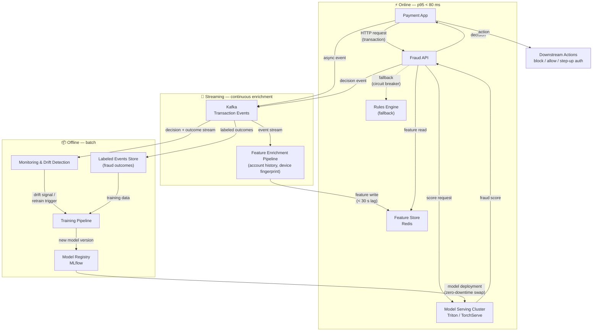

# Architecture — Real-time Fraud Scoring

## Serving boundary

| Zone | Components | Latency target |
|---|---|---|
| **Online** | Payment App → Fraud API → Feature Store + Model Serving Cluster | p95 < 80 ms |
| **Streaming** | Kafka → Feature Enrichment Pipeline → Redis | Features stale < 30 s |
| **Offline** | Training Pipeline, Model Registry, Monitoring | Hours to days |

## Latency budget (80 ms)

| Hop | Allocation |
|---|---|
| Network + API gateway | ~5 ms |
| Redis feature read | ~1 ms |
| Model Serving Cluster inference | ~20–30 ms |
| API overhead + serialization | ~10 ms |
| Headroom / queuing | ~35 ms |
